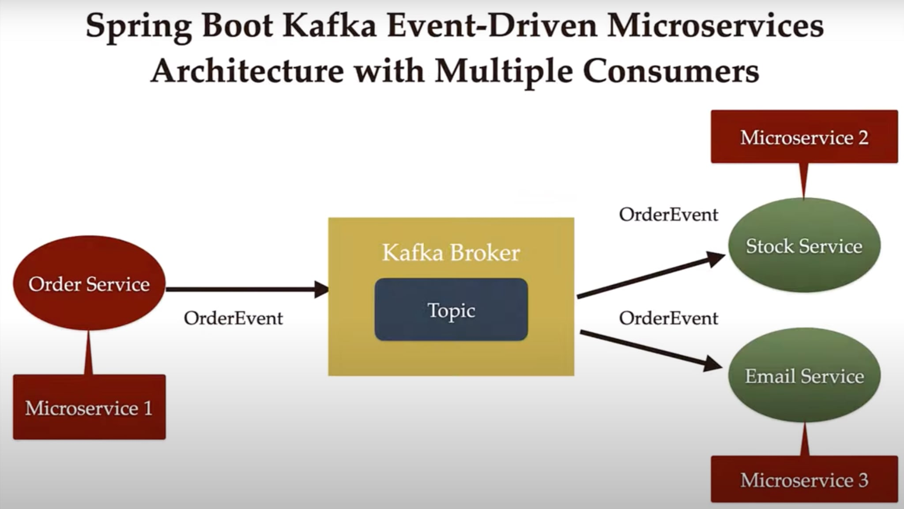

# Microservices in Kafka Event-Driven Architecture

This project is a simple example that uses a Spring Boot microservices architecture that uses Apache Kafka for event-driven communication between services. The architecture includes multiple microservices that communicate asynchronously by publishing and consuming events via Kafka topics.


---

## 1️⃣ Order Service (Microservice 1)

- **Responsibility:** Publishes `OrderEvent` to Kafka topic.
- **Role:** Acts as the **Producer** in the Kafka ecosystem.

---

## 2️⃣ Stock Service (Microservice 2)

- **Responsibility:** Listens to the Kafka topic.
- **Action:** Consumes `OrderEvent` 
- **Role:** Acts as a **Consumer**.

---

## 3️⃣ Email Service (Microservice 3)

- **Responsibility:** Also listens to the same Kafka topic.
- **Action:** Consumes `OrderEvent` to:
  - Send a confirmation email to the customer.
- **Role:** Acts as a **Consumer**.

---

Each of these services runs independently and communicates via events using **Kafka Topics**, allowing for a loosely coupled and scalable architecture.

##  Getting Started

It is straightforward: First, clone the project and then navigate into each microservice directory (`order-service`, `stock-service` and `email-service`) to start the Spring Boot application (IntelliJ IDE is preferred). After that, start Kafka and run each services.

# Testing the Flow

Send a POST request to `order-service` to create an order.

Observe logs in `stock-service` and `email-service` to verify they received and processed the event. 

For example: use a tool like **Postman** or **cURL** to create an order:

```bash
curl -X POST http://localhost:8080/api/orders \
     -H "Content-Type: application/json" \
     -d '{
    "name": "Book order",
    "qty": 50,
    "price": 18000
    }'
```
Check the terminal logs for:  
`stock-service` – should receive the event  
`email-service` – should receive the event


