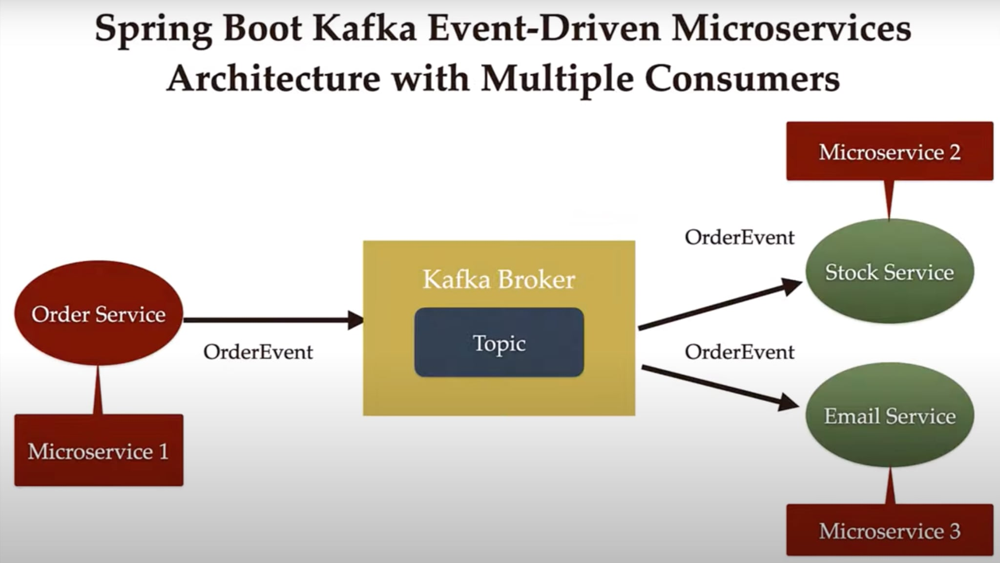

# Microservices in Kafka Event-Driven Architecture

This project is a simple example that uses a Spring Boot microservices architecture that uses Apache Kafka for event-driven communication between services. The architecture includes multiple microservices that communicate asynchronously by publishing and consuming events via Kafka topics.


---

## 1️⃣ Order Service (Microservice 1)

- **Responsibility:** Publishes `OrderEvent` to Kafka topic.
- **Role:** Acts as the **Producer** in the Kafka ecosystem.

---

## 2️⃣ Stock Service (Microservice 2)

- **Responsibility:** Listens to the Kafka topic.
- **Action:** Consumes `OrderEvent` 
- **Role:** Acts as a **Consumer**.

---

## 3️⃣ Email Service (Microservice 3)

- **Responsibility:** Also listens to the same Kafka topic.
- **Action:** Consumes `OrderEvent` to:
  - Send a confirmation email to the customer.
- **Role:** Acts as a **Consumer**.

---

Each of these services runs independently and communicates via events using **Kafka Topics**, allowing for a loosely coupled and scalable architecture.

## Getting Started

### Prerequisites
- **Java 17+**
- **Maven** (or use the included `mvnw` wrapper)
- **Apache Kafka** running on `localhost:9092`

---

### Step 1 — Start Kafka

**Option A: Homebrew (Mac)**
```bash
# Start Zookeeper
zookeeper-server-start /usr/local/etc/kafka/zookeeper.properties

# In a new terminal, start Kafka
kafka-server-start /usr/local/etc/kafka/server.properties
```

**Option B: Docker**
```bash
docker run -d --name zookeeper -p 2181:2181 zookeeper
docker run -d --name kafka -p 9092:9092 \
  -e KAFKA_ZOOKEEPER_CONNECT=host.docker.internal:2181 \
  -e KAFKA_ADVERTISED_LISTENERS=PLAINTEXT://localhost:9092 \
  apache/kafka
```

---

### Step 2 — Build the Shared Module

The services depend on `base-domains`, so install it first:
```bash
cd base-domains
./mvnw clean install -DskipTests
```

---

### Step 3 — Run Each Service

Open **three separate terminals**:

```bash
# Terminal 1 — Order Service (port 8080)
cd order-service && ./mvnw spring-boot:run

# Terminal 2 — Stock Service (port 8081)
cd stock-service && ./mvnw spring-boot:run

# Terminal 3 — Email Service (port 8082)
cd email-service && ./mvnw spring-boot:run
```

---

## Testing the Flow

Send a POST request to `order-service` to create an order:

```bash
curl -X POST http://localhost:8080/api/orders \
     -H "Content-Type: application/json" \
     -d '{
    "name": "Book order",
    "qty": 50,
    "price": 18000
    }'
```

Check the terminal logs for:  
`stock-service` – should receive the event  
`email-service` – should receive the event


